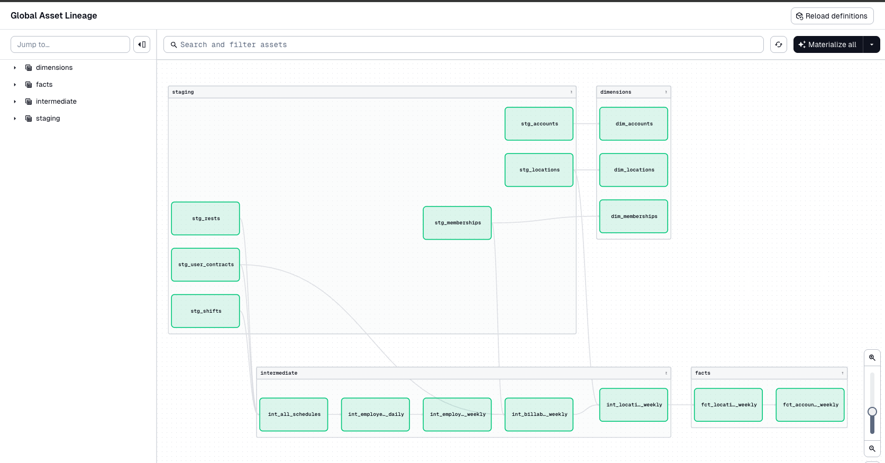

# 📊 Billing Analytics Pipeline (Dagster + Python)

## 📌 Overview

This project implements a production-style analytics pipeline to compute billing metrics under a **usage-based pricing model** for a SaaS company.

The pipeline ingests raw operational data (accounts, locations, employees, contracts, shifts, and rests) and transforms it into **accurate, auditable weekly billing metrics**.

It is designed to reflect modern data platform practices using:
- **Dagster** for orchestration
- **Python-based transformations**
- **DuckDB** as the analytical engine

---

## 🧠 Business Context

The company operates under a usage-based pricing model where customers are billed based on the **actual activity of employees across locations**.

This introduces several challenges:
- Pricing must reflect real usage, not static configurations
- Employee activity must be tracked across contracts and schedules
- Billing must be computed at a **weekly granularity**

---

## 💰 Pricing Model

Billing is calculated per **location per week**, using two components:

### 1. Base Price by Location Size

| Size  | Employees | Base Price |
|------|----------|-----------|
| Micro | 0–5      | €60       |
| Small | 6–39     | €80       |
| Large | 40+      | €216      |

### 2. Additional Employee Costs

- Employees **7–39** → €4 each  
- Employees **40+** → €2.4 each  

---

## 📏 Key Business Definitions

### Billable Employee

An employee is considered **billable for a contract** if they have at least one **shift or rest event during the week**.

- Billing is tied to the **contract location**, not where the shift occurred  
- A single activity (shift or rest) is sufficient  

---

### Billable Location

A location is billable if:
- It is **not archived**
- It has at least one billable employee

Location size (Micro / Small / Large) is determined **weekly**, based on active employees.

---

### ⏱ Temporal Logic

- Metrics are computed **weekly**
- Week definition:
  - Start: Monday 00:00 UTC  
  - End: Sunday 23:59 UTC  

---

## ❓ Key Questions Answered

This pipeline answers:

1. **Billing Metrics**
   - Number of billable locations per account per week  
   - Number of billable employees per account per week  

2. **Revenue Estimation**
   - Expected weekly revenue per account under the pricing model  

3. **Data Quality**
   - Identification and handling of anomalies and inconsistencies  

---

## 🏗️ Architecture

### Tech Stack

- **Dagster** → orchestration  
- **Python** → transformation logic  
- **DuckDB** → data warehouse  
- **CSV files** → raw data sources  

---

## 📁 Project Structure

```bash
billing_analytics_pipeline/
├── data/
│   ├── raw/
│   └── warehouse.duckdb
├── src/billing_analytics_pipeline/
│   ├── assets/
│   │   ├── staging.py
│   │   ├── intermediate.py
│   │   ├── dimensions.py
│   │   ├── facts.py
│   ├── resources/
│   │   ├── duckdb_resource.py
│   │   ├── duckdb_io_manager.py
│   ├── definitions.py
├── tests/
├── load_raw_csvs.py


## 🔄 Data Modeling Approach

The pipeline follows a **layered architecture**, implemented using Dagster assets.

### 🟡 Staging Layer (`staging.py`)
- Cleans and standardizes raw data
- Handles:
  - inconsistent data types
  - boolean normalization
  - timestamp parsing
- Renames columns for consistency

---

### 🔵 Intermediate Layer (`intermediate.py`)
Encodes core business logic:

- Combines shifts and rests into unified activity events  
- Computes:
  - daily employee activity  
  - weekly employee activity  
- Resolves:
  - contract-to-location mapping  
  - employee deduplication across contracts  
- Ensures correct attribution of activity to the employee’s **home location**

---

### 🟢 Dimension Layer (`dimensions.py`)
Defines reusable entities:

- accounts  
- locations  
- employees  
- calendar (weekly grain)  

These models provide clean reference tables for downstream joins.

---

### 🔴 Fact Layer (`facts.py`)
Final business outputs:

- `fct_location_revenue_weekly`
- `fct_account_billing_weekly`
- `dim_accounts`
- `dim_locations`
- `dim_memberships`


These models:
- apply pricing logic  
- aggregate metrics to the account level  
- ensure consistent grain for reporting  




---

## ⚙️ Orchestration with Dagster

This project uses Dagster’s **asset-based architecture**:

- Each transformation is defined as an **asset**
- Dependencies form a clear DAG
- Assets can be materialized independently or as part of the full pipeline
- Assets are grouped to ensure proper categorization and group materializations
- Assets are scheduled to materialize 2am from Monday to Friday in accordance with business needs

### Key Benefits

- Modular and maintainable pipeline design  
- Clear data lineage across layers  
- Easy debugging and recomputation  
- Separation of compute and storage via IO managers  

---

## 💰 Pricing Implementation

Revenue is calculated per location per week using the following steps:

1. Count billable employees  
2. Determine location size (Micro / Small / Large)  
3. Apply:
   - base pricing  
   - incremental employee pricing  
4. Aggregate results to the account level  

This ensures pricing is fully aligned with actual usage.

---

## 🧪 Data Quality & Edge Cases

The pipeline accounts for real-world data inconsistencies such as:

- Missing contract references in shifts/rests  
- Missing membership references in contracts  
- Inconsistent boolean formats (`true/false`, `1/0`, `Yes/No`)  
- Duplicate employees due to multiple contracts  
- Employees with no recorded activity  

### Approach

- Invalid records filtered through joins  
- Grain strictly enforced to prevent duplication  
- Business logic prioritized over imperfect raw data  

---

## ✅ Validation Strategy

Validation includes:

- Ensuring no duplication at each model grain  
- Verifying consistency between aggregation layers  
- Validating pricing calculations across thresholds  

These checks ensure:
- correct billing logic  
- no double counting  
- reliable outputs for downstream use  

---

## 📊 Final Output

### `fct_account_billing_weekly`

Key metrics:

- `billable_locations`
- `billable_employees`
- `expected_weekly_revenue`

This dataset is ready for:
- billing systems  
- financial reporting  
- analytics and dashboards  

---

## 🚀 How to Run the Project

```bash
# Install dependencies
pip install -r requirements.txt

# Load raw data into DuckDB
python load_raw_csvs.py

# Start Dagster
dagster dev